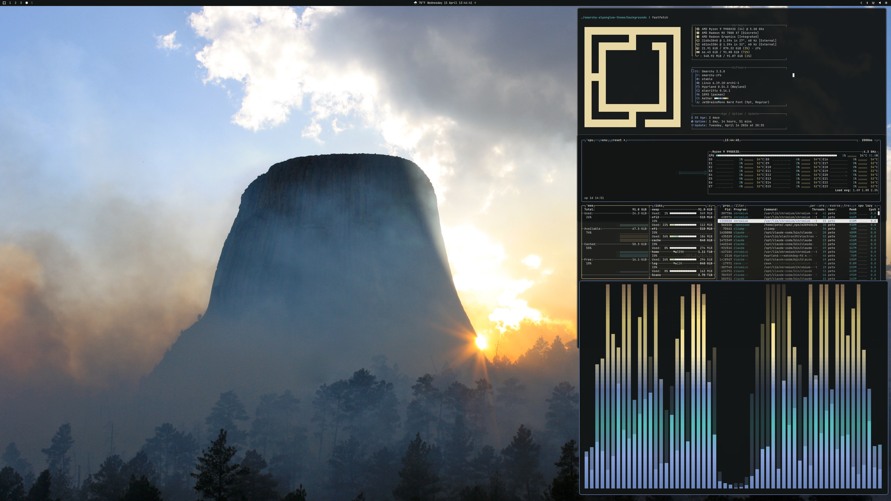
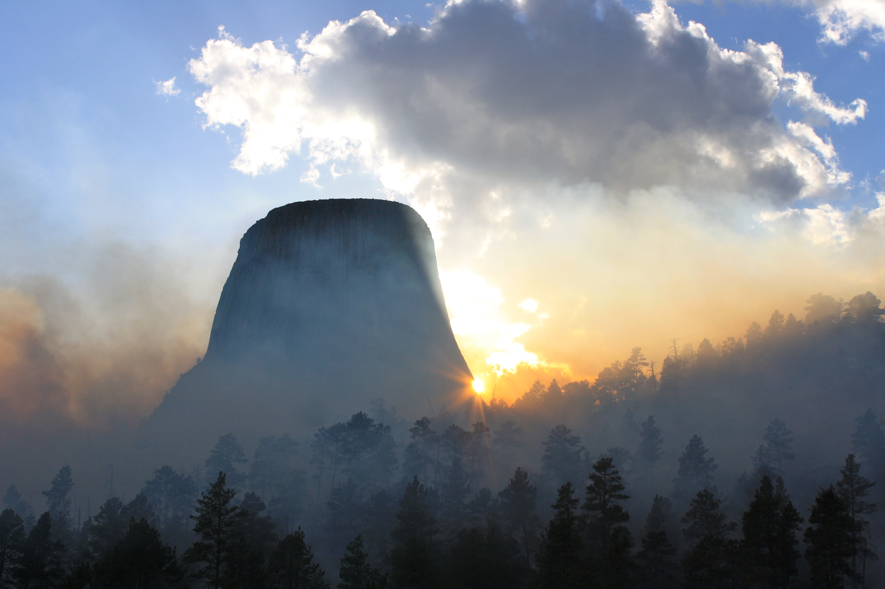
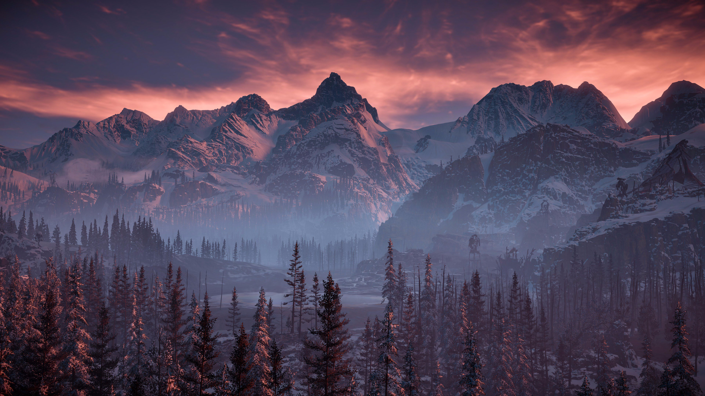
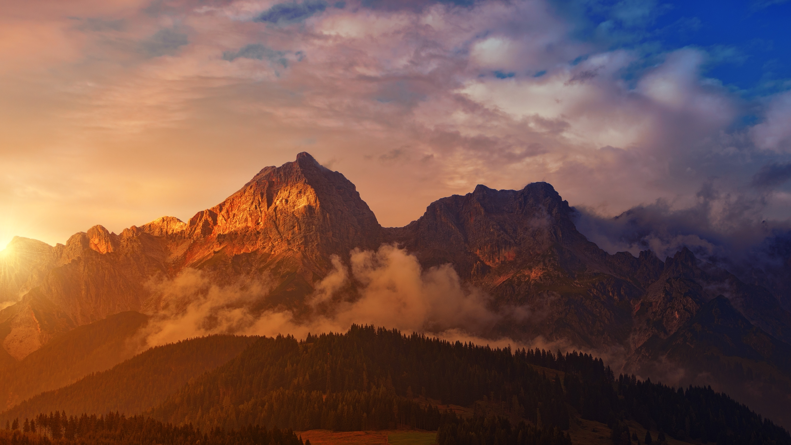
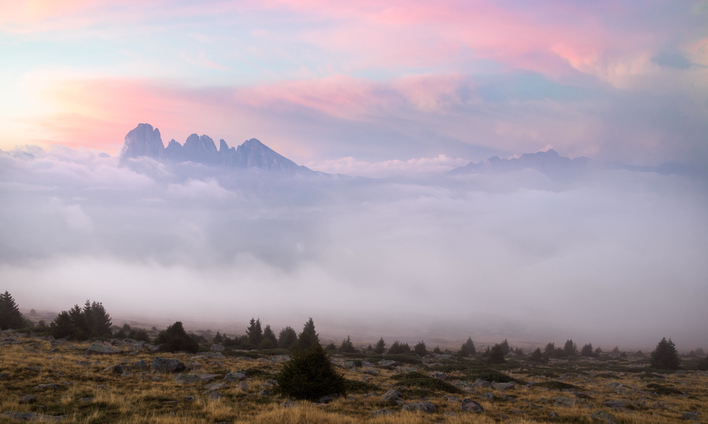
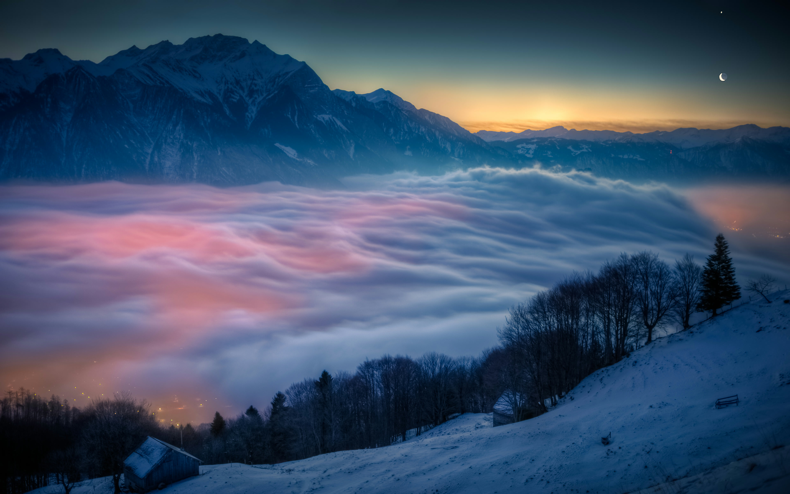
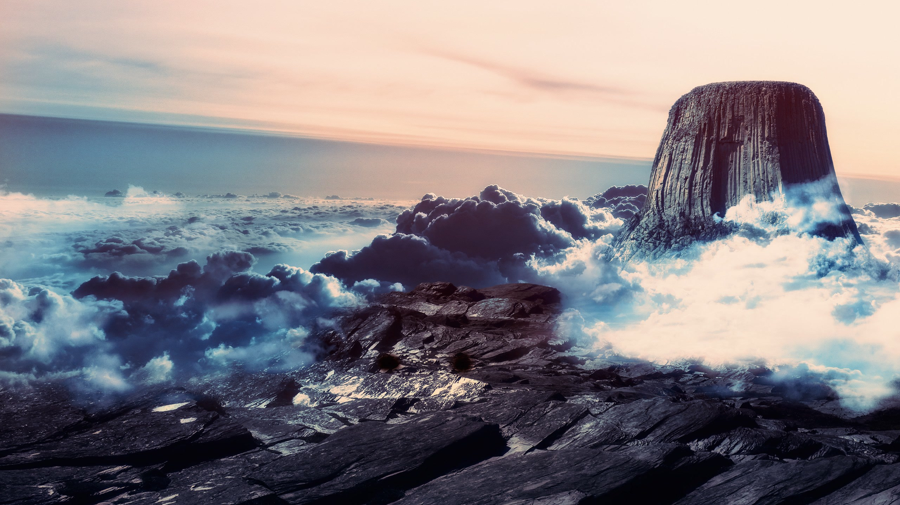
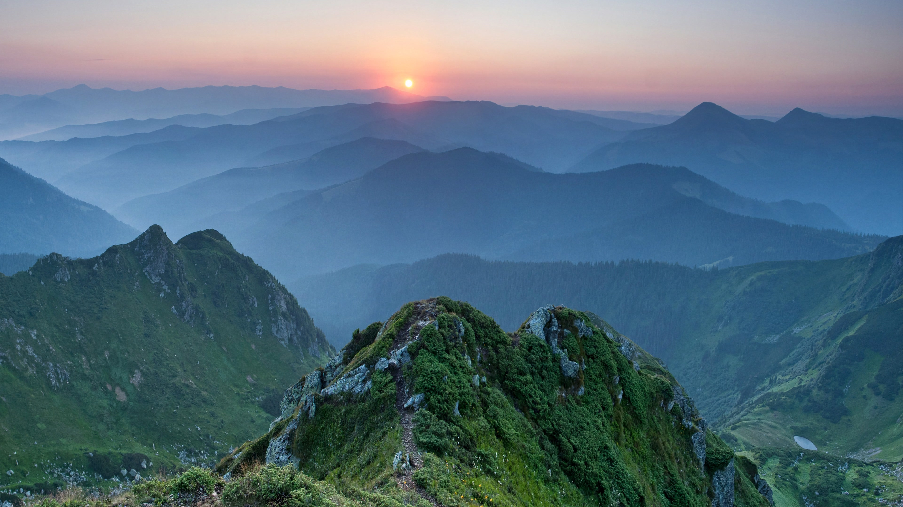

# Omarchy Alpenglow Theme

A warm-light-on-cold-mountain theme for Omarchy. Silhouetted peaks, wildfire
smoke, and the last golden hour before the sky goes blue — all calibrated
around the palette of Devils Tower at twilight.

Named for [alpenglow](https://en.wikipedia.org/wiki/Alpenglow), the phenomenon
where mountains hold warm light after the sun has set.

## Preview



## Install

```bash
omarchy-theme-install https://github.com/peteonrails/omarchy-alpenglow-theme
```

That's it for core theming — terminals, Hyprland, Waybar, Mako, and SwayOSD
all pick up Alpenglow automatically.

For optional extras (CAVA, Zed, Warp, GTK4, Vencord), run the helper script
(pattern borrowed from [signaldirective](https://github.com/signaldirective)'s
[Andromeda theme](https://github.com/signaldirective/andromeda)):

```bash
cd ~/.config/omarchy/themes/alpenglow
./install.sh
```

Omarchy doesn't currently run post-install hooks, so this is a separate manual
step. Every prompt is skippable — see [Optional Extras](#optional-extras) below.

Cycle wallpapers with `omarchy-theme-bg-next` or from the Omarchy menu.

## What's Included

- Hyprland window/border tuning (`hyprland.conf`)
- Hyprlock styling (`hyprlock.conf`)
- Terminal palettes for Alacritty, Kitty, Ghostty, Foot, and Warp
- UI surfaces for GTK, Walker, mako, and SwayOSD
- App themes for btop, Neovim, VSCode, Vencord, and Aether/Zed
- Optional [CAVA](https://github.com/karlstav/cava) audio-visualizer palette (`cava.theme`)
- Eight curated wallpapers of peaks, mist, and golden-hour skies

## Palette

The palette was extracted from Devils Tower at twilight — a Wyoming sandstone
monolith silhouetted in wildfire smoke.

| Role | Color |
|------|-------|
| Background | `#121515` |
| Foreground | `#FCFBF8` |
| Accent | `#6E89C2` |
| Warm highlights | `#F8E7AE`, `#FEE88B`, `#A48364` |
| Cool highlights | `#6E89C2`, `#8BA6DF`, `#59c1c0` |

See [`colors.toml`](colors.toml) for the full 16-color ANSI palette.

## Wallpapers

<table>
  <tr>
    <td></td>
    <td></td>
    <td></td>
    <td></td>
  </tr>
  <tr>
    <td></td>
    <td></td>
    <td></td>
    <td></td>
  </tr>
</table>

## Optional Extras

Omarchy auto-applies core theming (terminals, Hyprland, Waybar, Mako, SwayOSD, etc.)
when you run `omarchy-theme-set alpenglow`. Some extras aren't wired into
Omarchy's theme system and need a manual step. A helper script is included —
thanks to [signaldirective](https://github.com/signaldirective) and the
[Andromeda theme](https://github.com/signaldirective/andromeda) for the
prompt/backup/install pattern this script follows:

```bash
cd ~/.config/omarchy/themes/alpenglow
./install.sh
```

It detects what's installed on your system and prompts for each extra:

- **CAVA** — installs the color gradient to `~/.config/cava/themes/alpenglow` and (optionally) updates `~/.config/cava/config` to use it.
- **Zed** — installs the theme to `~/.config/zed/themes/alpenglow.json`.
- **Warp** — installs the theme to `~/.local/state/warp-terminal/themes/alpenglow.yaml`.
- **Wezterm** — installs the color scheme to `~/.config/wezterm/colors/alpenglow.toml` (activate with `config.color_scheme = 'Alpenglow'` + `config.window_background_opacity = 0.87`).
- **Rio** — installs the color scheme to `~/.config/rio/themes/alpenglow.toml` (activate with `theme = "alpenglow"` + `[window] opacity = 0.87`).
- **GTK4** — overlays `gtk.css` into `~/.config/gtk-4.0/gtk.css` (backs up existing).
- **Vencord** — installs the Discord theme to `~/.config/Vencord/themes/`.
- **Waybar** — appends a fenced block to your `~/.config/waybar/style.css` that colorizes modules (clock gold, audio teal, active workspace accent blue, etc.). See [Waybar Colorization](#waybar-colorization) below.

Every prompt defaults to "no" — it won't touch anything without your OK. Existing
files are backed up with a `.bak.<timestamp>` suffix before replacement.

## Waybar Colorization

Alpenglow ships an extended `waybar.css` with the full palette as CSS variables
(`@color1`…`@color8`). These are available automatically in your Waybar config
via the usual `@import "../omarchy/current/theme/waybar.css";` line.

The install script appends a fenced block of per-module color rules to your
`~/.config/waybar/style.css`. To uninstall, delete the block between the
`alpenglow-waybar-scheme:start` / `:end` markers.

If you'd rather wire it up manually, here's the block:

```css
#custom-omarchy                   { color: @color4; }
#workspaces button.active label,
#workspaces button.focused label  { color: @color4; }
#clock                            { color: @color3; }
#custom-weather                   { color: @color5; }
#battery                          { color: @color2; }
#pulseaudio                       { color: @color6; }
#network, #bluetooth              { color: @color4; }
#cpu                              { color: @color8; }
#custom-update                    { color: @color1; }
```

Selectors assume the stock Omarchy Waybar module names. Unknown selectors are
silently ignored, so modules you don't use won't cause issues. The `label`
selector on workspace buttons is required because Omarchy's default style resets
buttons with `all: initial`, which otherwise wipes the color.

## Requirements

- Omarchy (Hyprland-based)
- A terminal with theme import support (Alacritty, Kitty, Ghostty, or Warp)

## Credits

Wallpapers are sourced from [Wallhaven](https://wallhaven.cc) — see
[CREDITS.md](CREDITS.md) for per-wallpaper attribution.

Palette built using [Aether](https://github.com/bjarneo/aether).

Thanks to [**OldJobobo**](https://github.com/OldJobobo) for pro tips that
meaningfully improved this theme — specifically the terminal-only opacity
approach (text stays crisp, background goes transparent; browsers, Discord,
1Password etc. remain fully opaque) and `ffmpeg -q:v 2` wallpaper
recompression, which took the backgrounds directory from 23MB to 9MB.
